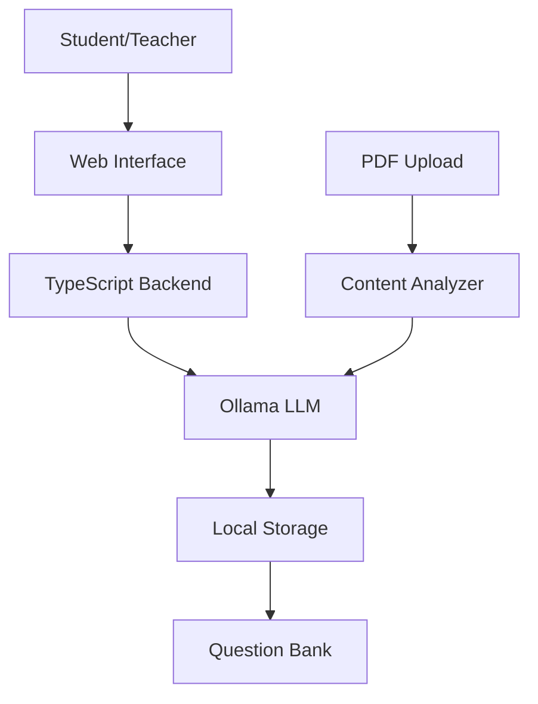

# AI-Powered Educational Quiz Generator

An innovative educational tool designed to support students in low-connectivity areas by providing AI-generated, curriculum-aligned quizzes. This application makes quality educational content accessible offline, ensuring students can continue learning effectively regardless of internet availability.

## 🎯 Mission & Goals

Our primary mission is to bridge the educational gap in areas with limited internet connectivity by:

- 📚 Providing curriculum-aligned quiz content that matches school materials
- 🌐 Enabling offline learning through local AI processing
- 📊 Supporting personalized learning paths for different grade levels
- 🎓 Making quality educational content accessible to all students

## ✨ Key Features

### Current Features
- 🤖 **AI-Powered Question Generation**
  - Curriculum-aligned questions using local LLM (Ollama)
  - Support for multiple grade levels (Elementary to Senior)
  - Topic and subtopic-specific question generation

- 📚 **Educational Framework**
  - Multiple curriculum support (National, Cambridge, IB)
  - Grade-level appropriate content
  - Detailed explanations for deeper understanding

- 💡 **Learning Tools**
  - Immediate feedback system
  - Progress tracking
  - Topic history for revision
  - Adaptive difficulty based on grade level

- 🎨 **Optimized User Experience**
  - Dual-mode interface (Setup/Quiz)
  - Offline-first design
  - Keyboard shortcuts for easy navigation
  - Mobile-responsive layout

### 🚀 Planned Improvements

1. **PDF Integration & Smart Content Analysis**
   - Upload textbooks and study materials in PDF format
   - Automatic topic/subtopic extraction from content pages
   - Question generation based on specific textbook content
   - Evidence-based answer validation with page references

2. **Enhanced Offline Capabilities**
   - Complete offline operation after initial setup
   - Local storage of frequently used materials
   - Batch generation of quizzes for offline use

3. **Learning Analytics**
   - Student progress tracking
   - Topic mastery analysis
   - Personalized learning recommendations
   - Performance reports for educators

## 🛠️ Technical Stack

### Core Technologies
- **Frontend**: HTML5, CSS3, Vanilla JavaScript
- **Backend**: TypeScript, Express.js, Node.js
- **AI Engine**: 
  - Local LLM: Ollama
  - Model: Gemma3n:e4b
  - Offline processing capability

### Architecture


## 🚀 Quick Start

1. **System Requirements**
   ```bash
   - RAM: 4GB minimum (8GB recommended)
   - Storage: 10GB free space
   - CPU: 4 cores recommended
   ```

2. **Installation**
   ```bash
   # Clone the repository
   git clone <repository-url>
   cd quiz-generator-ollama

   # Install dependencies
   npm install

   # Install Ollama and pull the model
   ollama pull gemma3n:e4b
   ```

3. **Start the Application**
   ```bash
   # Start Ollama
   ollama serve

   # Start the application
   npm run dev
   ```

## 👥 Target Users

- **Students** in areas with limited internet connectivity
- **Teachers** looking to create curriculum-aligned assessments
- **Schools** in developing regions
- **Educational NGOs** working in remote areas

## 💡 Usage Scenarios

### For Students
1. Select your grade level and curriculum
2. Choose a subject and topic from your textbook
3. Generate and take quizzes aligned with your studies
4. Review explanations and track your progress

### For Teachers
1. Upload class materials or textbooks
2. Generate topic-specific quizzes
3. Track student progress
4. Create customized assessments

## 🤝 Contributing

We welcome contributions that help make education more accessible! Areas where you can help:

- PDF processing and text extraction
- Offline functionality improvements
- Educational content validation
- UI/UX enhancements
- Documentation in multiple languages

## 📝 License

This project is licensed under the MIT License - see the LICENSE file for details.

## 🙏 Acknowledgments

- [Ollama](https://ollama.ai) for enabling local AI processing
- [Google](https://blog.google/technology/ai/gemma-open-models/) for the Gemma model
- The open-source community
- Educators and students who provide valuable feedback

---

<div align="center">
Made with ❤️ for accessible education
</div>